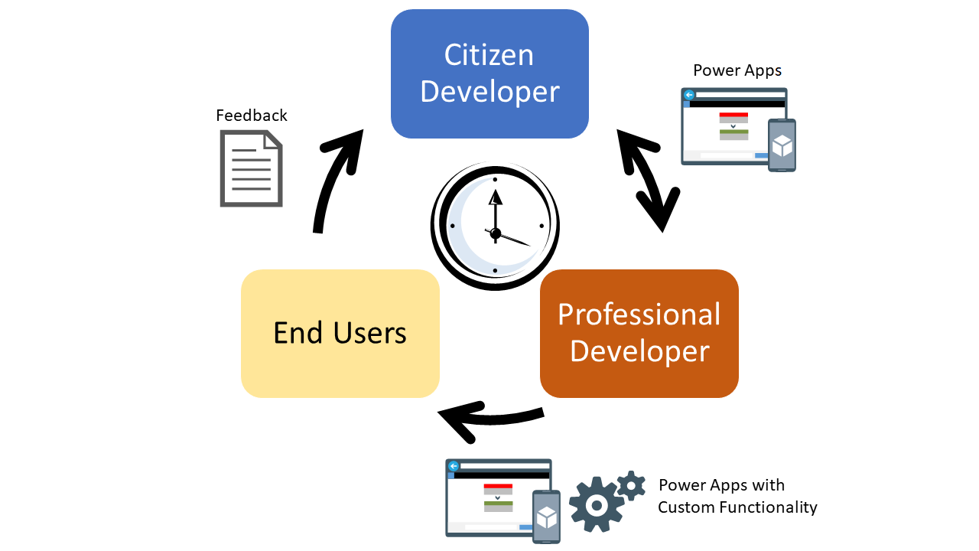
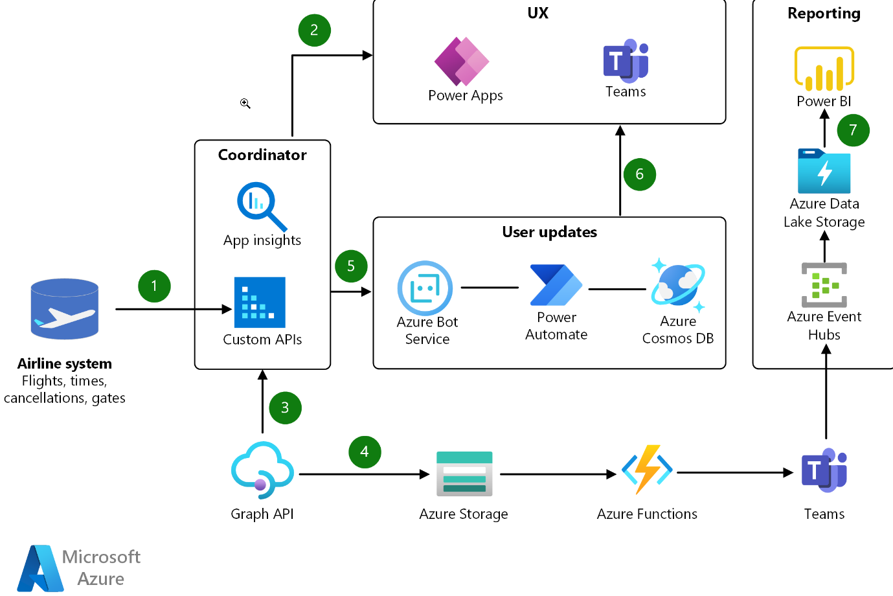

# Describe the business value of the Microsoft Power Platform

Microsoft Power Platform enables your business to craft solutions while empowering you to unite customized technology to help everyone and to drive the business with data-driven insights.

---

## Power Platform Consistuents

- Power Apps
    - Provides a low-code platform for building custom applications.
    - Enables users to create apps that can run on web and mobile devices.
- Power Automate
    - Creates automated workflows between applications and services.
- Power BI
    - Stands for Business Intelligence.
    - Provides data visualization and business analytics tools, with a built-in governance and security, so that we can scale it across the organisation.
- Power Pages
    - enterprise SaaS solution for building secure, low-code business websites.

### Supporting Tools

- MCS (Microsoft Copilot Studio)
    - low-code tool that brings together a set of powerful conversational capabilities from custom GPTs
- Connectors 
    - used by Power Apps, Power Automate flow, and logic apps.
    - enable you to connect apps, data, and devices in the cloud.
    - provide a way to integrate various services and applications.
- AI Builder
    - allows users and developers to add AI capabilities to the workflows and Power Apps they create and use.
- Dataverse
    - the common currency that enables the components of Power Platform to work together
    - lets users securely store and manage data from multiple sources and integrate that data in business applications using a common data model to ensure ease and consistency to users
- Power FX
    - the low-code programming language that is used across Power Platform
- Managed Environment
    - selected, secure, and isolated environments within Power Platform.
    - allow organizations to build, test, and deploy applications while maintaining control over data and resources.

## Business Value of the Power Platform

Not only to address the constant demands for targeted application and labour shortages, Power Platform also addresses the following business values:

- Changing workforce expectations
    - Gen Z grew up in a world of tailored experiences and collaborating through social media.
    - Digital experiences need to be able to deliver more custom, streamlined, and collaborative.
- Increased costs for custom application development
    - custom application development is expensive, and maintaining those applications is even more expensive. 
- Need to become more agile
    - Business strategies and needs change rapidly
    - We need to be able to quickly build solutions based on those changing needs.
- Need to scale development efficiently
    - By responsibly enabling **citizen developers (power users)** as part of development processes, we can create hybrid development teams that empower the entire organisation to grow.

Power Platform enables a "fusion development" approach, where IT and citizen developers work together to build applications that meet the needs of the business. This approach allows for faster development cycles, better collaboration, and more innovative solutions.

# Connectors and Dataverse

## Connectors

With Power Platform, data connectors make working with different data sources easier.  Power Platform has more than 900 connectors available to various data sources. Connectors also include a series of actions that simplify the process of working with those data sources. For example:

- **Outlook** connector
    - has prebuilt actions for working with mailboxes
    - such as downloading attachments
    - sending emails
    - managing events
- **Oracle** connector
    - has prebuilt actions for working with Oracle databases
    - such as creating, updating, and deleting records
- **SharePoint** connector
    - has prebuilt actions for working with SharePoint lists and libraries
    - such as creating, updating, and deleting list items
- **Teams** connector
    - has prebuilt actions for working with Teams channels and messages
    - such as creating, updating, and deleting channels

Data connectors are used throughout Power Platform.
1. In Power Apps
    - they're used to connect apps to data.
    - A company might create an order fulfillment application for their employees who work in the field. 
2. In Dataverse
    - used to connect the app to data sources like an SQL database. 
3. In Power Automate
    - used to connect to data sources that are used as either triggers or actions.

## Dataverse

Microsoft Dataverse allows organisations to securely store and manage data used by your business applications. Dataverse data is stored in tables. Each Dataverse instance includes a base set of standard tables that cover typical business scenarios such as accounts, contacts, and activities.

Using Dataverse provides these benefits:

- Easy to manage
    - Both the metadata and data are stored in the cloud.
- Easy to secure
    - Data is securely stored so users can only access what they need to. 
    - Role-based security allows you to control access to tables for different users within your organization.
- Rich metadata
    - Data types and relationships are used directly within Power Apps.
- Logic and validation
    - Define calculated columns, business rules, workflows, and business process flows to ensure data quality and drive business processes.
- Productivity tools
    - Tables are available within the add-ins for Microsoft Excel to increase productivity and ensure data accessibility.

# Use AI to Increase Productivity

You can simplify app creation or workflow design by using AI.

1. Power Apps
When you build a new application, the AI assistant is on the Power Apps home screen. Tell the AI assistant the type of information you want to collect and track. The assistant generates a Dataverse table and uses it to build your canvas app.

2. Power Automate
Cloud flows designer, a feature of Copilot, helps you easily get started building Power Automate flows.

3. Copilot Studio
The Power Virtual Agents AI builds your bot based on the description of your topics that you create or iterate. You can quickly create and deploy a functional bot without authoring multiple topics manually.

# Explore the Business Value of Power Fx

It is a low-code programming language that is similar to Excel formulas, used throughout Microsoft Power Platform. Examples include:

1. Power Apps
Power Fx is the foundational language used when building Canvas apps in Power Apps. It's used to control almost every aspect of a canvas application:
- defining when a control is visible
- filtering the contents of a gallery
- performing advanced calculations

2. Dataverse
It can be used to build calculated columns in Dataverse tables

3. Copilot Studio
Power Fx formulas are used when building out topics in Copilot Studio.

# Describe How Power Platform Works with Microsoft 365 Apps and Services
 
Power Platform includes multiple connectors that are designed to work with Microsoft 365 services. For example:

- Office 365 Outlook
- OneDrive
- Excel
- SharePoint

This helps users to remove manual tasks and automate processes. For example, you can create a flow that automatically saves email attachments to OneDrive or SharePoint.

# Explore How Power Platform Works with Microsoft Teams

When COVID-19 hit the world, organisations were forced to rethink how their work force gets things done. This introduced a need for better collaborative tools organisations can utilise.

Microsoft Teams provides a central point where users can collaborate with other users, have meetings, manage projects, and more. Microsoft Power Platform is the innovative gateway to rapidly build Teams compatible apps using low-code attributes. All Power Platform components can be used with Microsoft Teams. 

- Dedicated agents embedded in Microsoft Teams can answer agent questions and help them with day-to-day tasks. 
- A dedicated expense submission app can be built using Dataverse for Teams to help agents submit expenses related to travel, staging, and open houses right for Teams.
- **Power BI reports** can be easily embedded inside Microsoft Teams to provide analytics.

# Describe How Power Platform Works with Microsoft Dynamics 365 Apps

Dynamics 365 is a set of intelligent business applications that help organisations run their entire business and deliver greater results through predictive, AI-driven insights. Dynamics 365 has various **enterprise resource planning (ERP)** and **customer engagement applications** (from finance and intelligent order management to sales and customer service).

All customer engagement apps in Dynamics 365 are model-driven applications built using Power Apps i.e. They are based on a data model store within the Microsoft Dataverse. 
Not just the model-driven applications, but there are other components of Power Platform that those customer engagement apps uses:

- Power BI
    - You can embed Power BI visualizations into Dynamics 365 Sales or Dynamics 365 Customer Service.
- Power Automate
    - You can use Business Process Flow to guide users through a process.
- Copilot Studio
    - Applications such as Dynamics 365 Customer Service can provide support across multiple channels to easily direct incoming phone calls, SMS, or Facebook messages to an agent first
    - The agent can then escalate to a live customer service representative working in Dynamics 365 Customer Service, as needed.
- Power Pages
    - Power Pages makes it easy for organisations to create externally facing sites that connect to Dataverse that customers can access.

# Describe How Power Platform Solutions Consume Microsoft Azure Services

Azure services can be used with Power Platform to help modernise legacy systems, automate processes, and create advanced analytical solutions.
Employ Azure API management and Azure Functions to connect custom APIs, which tap into your legacy systems. By using Azure-managed databases and a low-code approach to automate tasks, you can lower the overall solution costs.

The data flow:

1. The airline system communicates with a custom API hosted in Azure API Management.
2. A custom API coordinator receives notifications and handles incoming messages from the airline system, assigning flights to Microsoft Teams channels and sending them to Power Apps.
3. The system queues a Graph API call in an Azure Storage Account queue for further processing when a user selects a flight to monitor, or when the system assigns the user to a flight
4. Azure Functions runs the Graph API calls based on the incoming messages in the storage queue, sending notifications to Teams, and also streams all events to an Azure Event Hubs for further analytics.
5. The airline's notification system uses a custom bot messaging service that employs Azure Bot Service.
6. Custom bots send flight updates to users in Teams.
7. An Azure Data Lake storage offers long-term retention and micro-batch processing of events from Event Hubs, ultimately generating insightful reports with Power BI.

