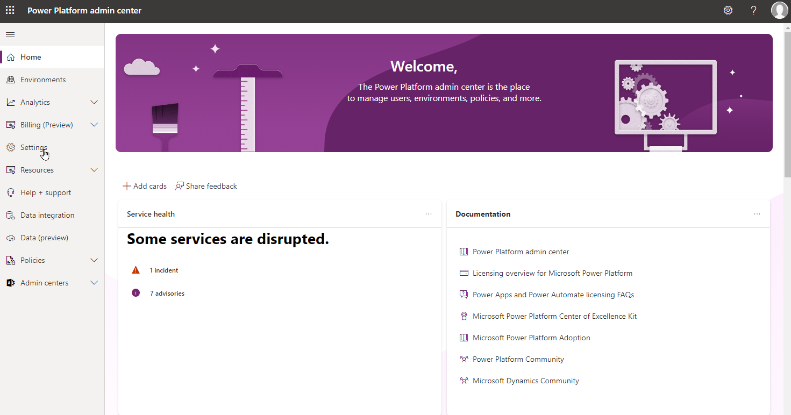
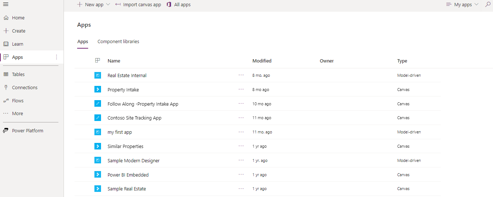
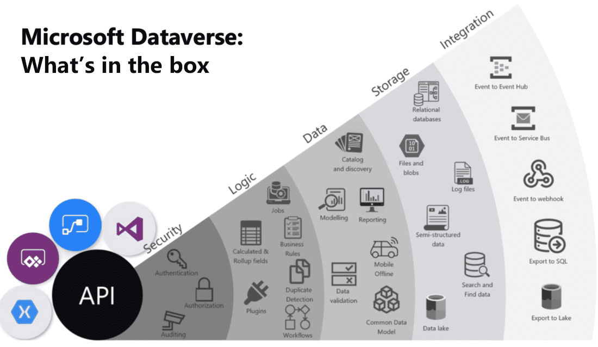

# Identify foundational components of Microsoft Power Platform 

To understand how to begin creating solutions with the Microsoft Power Platform, it's important to understand some of the key foundational elements involved in creating solutions.

---

# Power Platform Administration

In Power Platform, **environments** are used to store, manage, and share your organization's business data, apps, and flows. For each environment, you can provision one Microsoft Dataverse database for use within that environment. 

Each environment is created under a **Microsoft Azure Active Directory (Azure AD)** tenant. Only users within that tenant can access its resources. You can create more than one environment to manage solution development and data storage by setting up one environment for development, another for testing, and another for production use.

## Administrative Experiences

Microsoft Power Platform has a rich set of administrative experiences that can be used to administer the different aspects of your solution, that lets you to create new environments or manage security.

### Microsoft Power Platform Admin Center

The portal allows administrators to manage their environments and configure many of the primary settings for Power Apps, Power Automate, and customer engagement apps for Dynamics 365.

- Home
    - Provides overall information, such as if there are any services disruptions, etc. Different cards can be added to better personalize this screen based on your needs.
- Environments
    - This section lists all the environments in this tenant. This includes Microsoft Dataverse environments and other environments such as Dataverse for Teams environments.
- Analytics
    - This section provides analytical details about Microsoft Power Platform such as Dataverse analytics, Power Automate Flow Statistics, and Power Apps details.
- Billing
    - The billing center contains details related to user licenses.
- Settings
    - This section lets you review and manage settings at a tenet level, such as being able to control who can create and manage the different types of environments available.
- Resources
    - This section is where you can view capacity statistics for your tenant and manage and install features related to Dynamics 365 applications.
- Help + Support
    - This section is where you can create new support requests and manage any existing requests previously submitted.
- Data integration
    - This section lets you create or add predefined connections and monitor these connections between Microsoft Dataverse and other data stores like Salesforce or SQL Server.
- Data
    - This section is where you can manage the different data sources, on-premises data gateways, and virtual network data gateways associated with this tenant.
- Policies
    - This section is where you can manage some of the different data security policies and other security features, such as the Customer Lockbox and tenant isolation.
- Admin Centers
    - Provides access to the different admin centers that can impact Microsoft Power Platform solutions such as the Microsoft 365 admin center, Azure active directory, and more.

### Other Admin and Maker Portals

There are several different administrative experiences that can be used as part of Power Platform. Each of the primary Power Platform components has a corresponding maker portal. The table provides a list of the different maker portals available. 

| Product | URL | Description |
|---------|-----|-------------|
| Power Automate | https://make.powerautomate.com | Used to create and manage the Cloud and Desktop flows deployed. |
| Power BI | https://app.powerbi.com | Used to create and manage Power BI reports and dashboards. |
| Power Pages | https://make.powerpages.microsoft.com | Used to create modern, secure business websites that can be used by employees and customers. |
| Microsoft Copilot Studio (formerly Power Virtual Agents) | https://web.powerva.microsoft.com | Used to create intelligent copilots that can be used by employees and customers. |

Below is a list of the different components available in the Power Apps Maker Portal, which is used to make applications and manage the Dataverse instance associated with an environment.

- Tables
    - Allows you to manage the Microsoft Dataverse tables deployed in this environment. 
    - You can easily create new tables and perform tasks such as modifying the different forms, views, and relationships in the Dataverse instance.
- Connections
    - Allows you to manage the connections being used by apps in this environment.
- Flows
    - Provides access to any flows created for this environment.
- Chatbots
    - Provides access to any chatbots created for this environment.
- AI Models
    - Provides access to AI builder models for this environment.
- Solutions
    - Provides access to any Solutions deployed to this environment.
- Cards
    - Provides access to Cards created in this environment.
- Choices
    - Allows you to manage the choice columns in this environment.
- Dataflows
    - Provides access to Dataflows used in this environment.
- Power Platform
    - Provides access to other Power Platform Maker portals.

## Managed Environments

Managed Environments is a suite of premium level capabilities admins can use to manage Power Platform at scale, because sometimes it can be hard to control who has access to different applications and ensure the data in those applications is secure.

Once the administrator enables the Managed Environment, other features become available that administrators can configure. These features cover different elements across Power Platform. Key features available in a Managed Environment include:

- Limit sharing
    - Allows administrators to limit how broadly users can share canvas apps. 
    - e.g. you can prevent a user from sharing a canvas app with the entire organization.
- Weekly usage insights
    - Every week analytics are delivered to your mailbox. 
- Data policies
    - Data policies define the consumer connectors that data can be shared with. 
    - They ensure data is managed in a uniform manner across your organisation. 
    - They also prevent important business data from being accidentally published to connectors like social media sites.
- Pipelines in Power Platform
    - Power Platform administrators can create one or more pipelines, associate any number of environments, then share access with those individuals that administers or run pipelines.
- Solution checker
    - Solution checker in Managed Environments is used to enforce rich static analysis checks on your solutions against a set of best practice rules and identify problematic patterns.

# Security and Governance of Power Platform

Organizations want to know that their data isn't going to be compromised. For example, you don’t want to accidentally pass through sensitive information in an application. The Power Platform service follows the Security Development Lifecycle (SDL), a set of strict practices that support security assurance and compliance requirements. 

## Data Loss Prevention Policies
— act as guardrails to help prevent users from unintentionally exposing organizational data. 
DLP policies can be defined at the environment or tenant level, offering flexibility to craft sensible policies that strike the right balance between protection and productivity.

DLP policies also help manage and control the use of connectors within an organization. Connectors can be classified as follows:
- Business: Connectors that host business -use data.
- Non-Business: Connectors that host personal-use data.
- Blocked: Connectors that you want to restrict usage across one or more environments.

When a new policy is created, all connectors are defaulted to the **non-Business** group. From there, they can be moved to **Business** or **Blocked** based on your preference. 

## Compliance and Data Privacy

Microsoft provides the most comprehensive set of compliance offerings (including certifications and attestations) of any cloud service provider. These offerings help your organisation comply with national, regional, and industry-specific requirements governing the collection and use of individuals' data.

## Data Protection

Data in transit between user devices and the Microsoft datacenters are secured, using Transport Layer Security (TLS) specifically 1.2 or above for an API access from the customer endpoint to the server.

# Explore Microsoft Dataverse

Microsoft Dataverse is a cloud-based solution that easily structures various data and business logic to support interconnected applications and processes in a secure and compliant manner. Dataverse is different from traditional databases in that it's more than just tables. It incorporates security, logic, data, and storage into a central point. 

- Security 
    - handles authentication with Azure Active Directory (Azure AD) to allow for conditional access and multifactor authentication. 
    - It supports authorization down to the row and column level and provides rich auditing capabilities.
- Logic
    - allows you to easily apply business logic at the data level. 
    - These rules could be related to duplicate detection, business rules, workflows, or more.
- Data
    - offers you the control to shape your data, allowing you to discover, model, validate, and report on your data. 
    - This control ensures your data looks the way you want regardless of how it's used.
- Storage
    - Dataverse stores your physical data in the Azure cloud. 
- Integration
    - Dataverse connects in different ways to support your business needs.
    - APIs, webhooks, eventing, and data exports give you flexibility to get data in and out.

With your data stored in Microsoft Dataverse, there are many ways to access it. You can work with the data natively with tools such as Power Apps or Power Automate. Any business solution can connect to Dataverse using connectors APIs. A Dataverse database supports large data sets and complex data models. Tables can hold millions of items, and you can extend the storage in each instance of a Microsoft Dataverse database to **4TB** 

## Microsoft Dataverse Structure and Benefits

The structure of a Microsoft Dataverse database is based upon the definitions and schema in the Common Data Model.

### Types of Tables

There are three types of tables in Microsoft Dataverse:
1. **Standard**
Several standard tables, also known as out-of-box tables, are included with a Dataverse environment e.g. Account, business unit, contact, task, and user tables are examples of standard tables in Dataverse. 
2. **Managed**
Tables that aren't customizable and are imported into the environment as part of a managed solution.
3. **Custom**
Custom tables are unmanaged tables that are either imported from an unmanaged solution or are new tables created directly in the Dataverse environment.

To connect several tables we can use relationships like how we build a normal database.

### Business Rules

Many organisations have business logic that impacts how they work with data. For example, an organisation that is using Dataverse to store customer information might want to make __Identification number__ a required field. In Microsoft Dataverse, you build this logic using **business rules**.

By applying this business rule at the data level instead of the app level, you have better control of your data. This ensures your business logic is followed whether it's being accessed directly from Power Apps, Power Automate, or even via an API. The rule is tied to the data, not the app.

### Workind with Dataflows

Dataflows are used to ingest, transform, and load data into Microsoft Dataverse environments, Power BI workspaces, or your organisation's **Azure Data Lake Storage** account. Dataflows are created using **Power Query**, a data connectivity and preparation experience that is already included in many Microsoft products, such as Excel and Power BI.

For example, Power BI, Power Apps, Power Automate, Power Virtual Agents, and Dynamics 365 applications can get the data produced by the dataflow by connecting to Dataverse, a Power Platform dataflow connector. 

### Common Data Model

When creating business solutions, you often need to integrate data across different business applications. This integration can be challenging as similar data may be stored differently across systems. To address this, multiple technology leaders created the Common Data Model initiative, aiming to establish a common structure easily applicable across various applications. 

Instead of building a new data model for your app, you can simply use the table definitions available to you. Common Data Model is used by various applications and services including Microsoft Dataverse, Dynamics 365, Microsoft Power Platform, and Azure. This commonality of data model ensures that all your services can access the same data. 

# Examine Power Platform Connectors

You can think of connectors as a bridge from your data source to your app or workflow. This bridge allows information to be conveyed back and forth. Connectors allow you to extend your business solutions across platforms and add functionality for your users.

## Data Sources 

To understand the types of connectors and their capabilities, you must first understand the types of data sources to which they connect. The two types of data sources are **tabular**, and **function based**.

- Tabular data : A tabular data source is one that returns data in a structured table format.
    - e.g. Microsoft Dataverse, SharePoint, and SQL Server.
- Function-based data : A function-based data source is one that uses functions to interact with the data source.
    - e.g. Office 365 Users, Project Online, and Azure Blob Storage.

Connectors are the bridges from your data source to your app, workflow, or dashboard. Microsoft Power Platform has more than 1,000 connectors available to common data sources. 

## Triggers and Actions

Once you established a data source and configured your connector, there are two types of operations you can use, triggers or actions.

**Triggers** are only used in Power Automate and prompt a flow to begin. Triggers can be time based, such as a Power Automate flow that begins every day at 8:00 am. 

**Actions** are used in Power Automate and Power Apps. Actions are prompted by the user or a trigger and allow interaction with your data source by some function. For example, an action would be sending an email in your workflow or app writing a new line to a data source.

## Types of connectors

### Standard Connectors

Standard tier connectors are connectors that are included in your standard Microsoft 365 subscription, e.g. SharePoint, OneDrive, and third-party data sources such as Google Drive, Twitter, GitHub, and more.

### Premium Connectors

The main advantage of premium connectors is that they allow you to connect to a larger number of services. Most premium connectors cover external applications such as Salesforce, DocuSign, Survey Monkey, Amazon, and so on. There are several Microsoft applications that use premium connectors such as Dynamics 365. The premium stamp identifies premium connectors.

### Custom Connectors

Custom connectors allow you to extend your app by calling a publicly available API, or a custom API you're hosting in a cloud provider, such as Azure.

Connectors work by sending information back and forth across these APIs and gathering available functions into Power Apps or Power Automate. Because these connectors are function-based, they call specific functions in the underlying service of the API to return the corresponding data.

You can use a blank custom connector to create a connector from scratch, or you can use a custom connector template to create a connector based on an existing API.