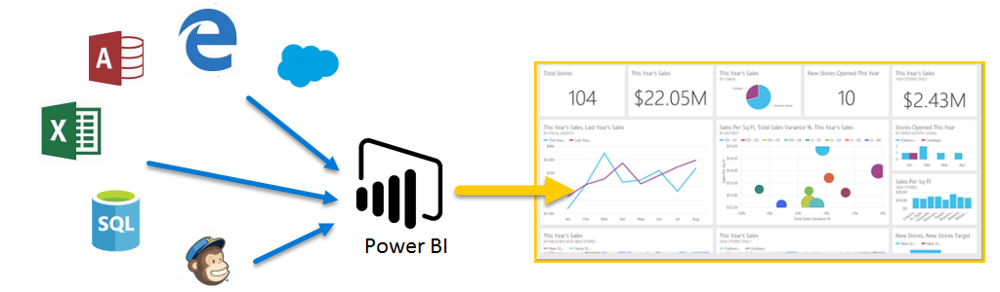

# Describe the Capabilities of Microsoft Power BI

Power BI takes intimidation and hassle out of data analysis and visualization. By connecting to one or more of the hundreds of existing data sources through a secure and simple interface, you can quickly interact with and understand your data to influence all business systems.

---

# Build Data-Driven Analytics Using Power BI

Microsoft Power BI is a collection of software services, apps, and connectors that work together to turn your unrelated sources of data into coherent, visually immersive, and interactive insights.

Power BI consists of:
- Microsoft Windows desktop application called **Power BI Desktop**
- An online SaaS service called the **Power BI service**
- **Mobile Power BI** apps that are available on phones and tablets.

These three elements, Power BI Desktop, Power BI Service, and Power BI Mobile apps are designed to let people create, share, and consume business insights in the way that serves them, or their role, most effectively.

# Different Power BI Elements

1. Capacities
A core Power BI concept representing a set of resources used to host and deliver your Power BI content.
- shared: shared with other Microsoft customers
- dedicated: fully committed to a single customer, require a subscription.

2. Workspaces
Containers for dashboards, reports, datasets, and dataflows in Power BI.
- My workspace : the personal workspace for any Power BI customer to work with your own content. Only you can see it.
- Workspaces : used to collaborate and share content with colleagues. You can add colleagues to your workspaces and collaborate on dashboards, reports, and datasets. All workspace members need Power BI Pro licenses.

3. Semantic Models
A collection of data that you import or connect to. They can also source data from dataflows. e.g. semantic model can contain data from an Excel workbook on OneDrive, an on-premises SSAS tabular semantic model, and/or a Salesforce semantic model. 

Those can be associated with workspaces, and a single semantic model can be part of multiple workspaces. You can also make a shared semantic model.

4. Reports
One or more pages of visualizations such as line charts, maps, and other elements. There are two modes to view and interact with reports:

- Reading view: when opened by a user, it's displayed in reading view.
- Editing view: used to modify the different elements on the report and how they're presented.

5. Dashboards
A single canvas that contains zero or more tiles and widgets. Each tile pinned from a report or from Q&A displays a single visualization that was created from a dataset and pinned to the dashboard. 

Why do people create dashboards:
- To see all information needed to make decisions in one glance.
- To monitor the most important information about your business.
- To ensure all colleagues are on the same page, viewing and using the same information.
- To monitor the health of a business, product, business unit, or marketing campaign, etc.
- To create a personalized view of a larger dashboard and show all the metrics that matter to them.

6. Template Apps
It enables Power BI partners to build Power BI apps with little or no coding and deploy them to any Power BI customer.

# Cleaning and Transforming Data in Power BI Desktop

Cleaning and transforming data is how you prepare your data and get it ready to be used. To begin transforming and cleaning data, you use the Power BI Desktop application.

Power BI Desktop has three views:

1. **Report view**
You can create queries to build compelling visualisations that you can share with others. 

2. **Data view**
See the data in your report in data model format, where you can add measures, create new columns, and manage relationships.

3. **Model view**
Get a graphical representation of the relationships that are established in your data model and manage or modify them as needed.

We use __Power Query Editor__ to shape and transform data so that it's ready for your models and visualisations. You can change types, remove columns, filter rows, and perform other transformations. 

# Spot Trends and Anomalies using AI Insights

Power BI's insights feature helps organizations easily identify insights such as anomalies and trends in your data as you interact and consume elements such as reports, dashboards, and visualisations. 

Power BI has multiple insights features that use AI:
- **Insights for reports:** analyses data and finds anomalies and trends in your data as you interact with reports.
- **Insights for individual visuals**: analyses and explains the fluctuations of data points in visuals.
- **Insights for dashboard tiles**: Looks at the data being used to render that tile and presents them in interactive visuals.
- **Quick Insights for datasets**: automatically generate data insights on a dataset in the Power BI service.
- **AI Insights for data models in Power Query**: Provide access to pretrained machine learning models from Azure Cognitive Services.

Notifications are an important part of the Insights capabilities in Power BI too. When Power BI identifies insights, you're presented with a notification. You can choose to either see the insights or ignore them.

## Insights pane 
It currently shows 3 types of insights:

1. Anomalies
Represents something that is out of the ordinary from what is expected. For example, a smart thermostat that suddenly reads the temperature as 100 F when it's typically 72 F would be considered an anomaly.
- Significant anomaly: The anomaly has a high score.
- Recent anomaly: The most recent anomaly in the measure.
- Anomaly summary: This insight type summarises multiple anomalies in the measure.

2. Trends
Represents a pattern that is found in time-series datasets. For example, if a company's sales are steadily increasing through the month of April that would represent a trend.
- **Long trend**: significant & the longest
- **Steep trend**: significant & the steepest
- **Recent trend**: significant & the most recent trend
- **Trend reversal**: Recent trend in a single series or across multiple series in a visual where the reversal is significant, compared to the previous trend segment.

3. Key Performance Indicator (KPI) analysis
Helps you evaluate the current value against a defined target. For example, a company might set a sales goal at 1.2 million, but currently they are at 1 million.
KPI analysis with a target looks at the variance of the current value to its target. It's considered significant if the variance is high or low compared to other segments. 

# Build a Basic Dashboard

With Power BI, we can easily create and share a dashboard with a manager by connecting to a data source such as an Excel spreadsheet on your laptop. You need to take the following steps:

1. Prepare your data
This ensures that it's in a format that Power BI can easily consume.

2. Build a report
The report contains the visuals that you want to include in your dashboard. 
Depending on the scenario, reports can be built in either Power BI Desktop or using the Power BI Service.

3. Pin the report visuals to a dashboard
Dashboards are the primary element that users use for viewing data. 
They can include data from multiple reports as needed.

4. Share a link to the dashboard
Any users with the link and the necessary permissions are easily able to view and interact with the data.

